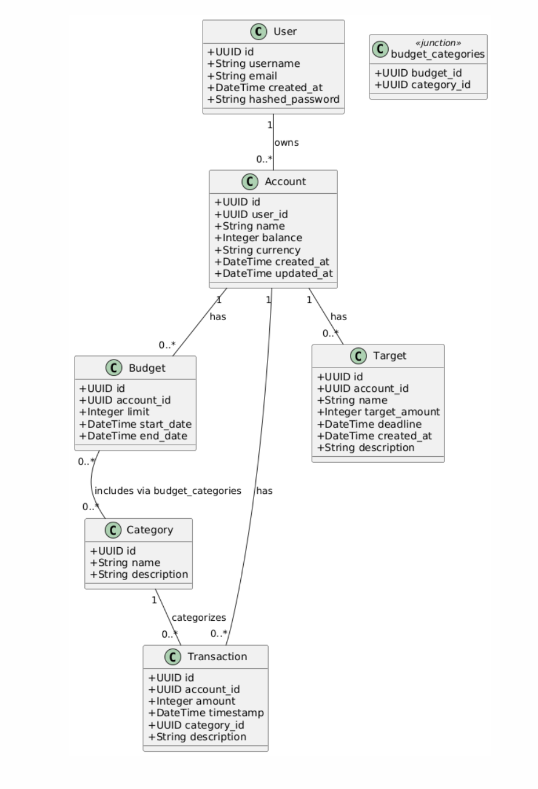
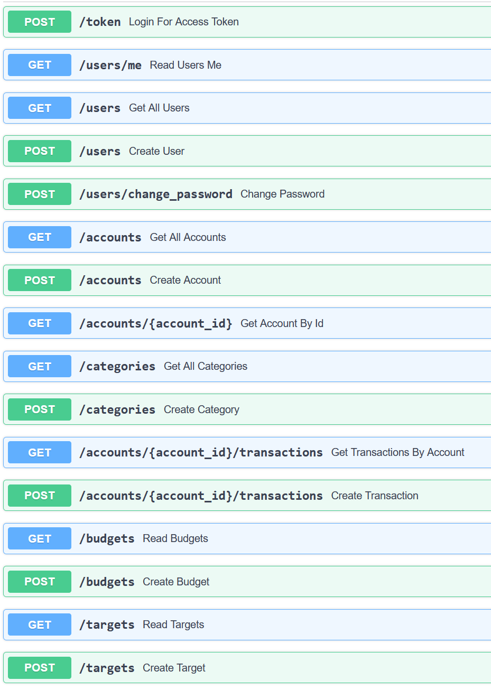
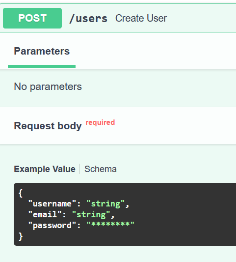

### Цели

Научится реализовывать полноценное серверное приложение с помощью фреймворка FastAPI с применением дополнительных
средств и библиотек.

### Тема

Необходиом создать простой сервис для управления личными финансами. Сервис должен позволять пользователям вводить доходы
и расходы, устанавливать бюджеты на различные категории, а также просматривать отчеты о своих финансах. Дополнительные
функции могут включать в себя возможность получения уведомлений о превышении бюджета, анализа трат и установки целей на
будущее.

### Модель данных

Для ведения учёта расходов и доходов используется транзакционная система с записью промежуточного итогу в баланс счёта.
У каждой транзакции есть своя категория. Приход или расход определяется по тому + или - знак в поле amount.
Чтобы ставить цели пользователь может завести отдельный счёт для накоплений. На этот счёт можно поставить цель и дедлайн.
Для бюджетирования есть функционал создания бюджета на категории и счёт, для которого он будет применяться.
У бюджета есть начальный и конечный срок.

### API



### Задание на 15 баллов
Эндпоинты авторизации и регистрации:
- /token - POST - получение токена доступа
- /users/me - GET - получение информации о текущем пользователе по токену и проверка его валидности
- /users - GET - получение списка всех пользователей
- /users - POST - регистрация


Пароль хранится в базе данных в виде хеша argon2. Генерируется через passlib.
Используется так же перец, который хранится в env файле. Соль хранится внутри строки получаемой из passlib в базе данных.

```python
pepper = os.getenv('PEPPER')

pwd_context = CryptContext(schemes=["argon2"])

def hash_password(plain_password: str) -> str:
    pwd_with_pepper = plain_password + pepper
    return pwd_context.hash(pwd_with_pepper)

def verify_password(plain_password: str, hashed: str) -> bool:
    pwd_with_pepper = plain_password + pepper
    return pwd_context.verify(pwd_with_pepper, hashed)
```

Генерирую JWT через jose и отдаю его в token эндпоинте
```python
def create_access_token(
    data: dict,
    expires_delta: Optional[timedelta] = None
) -> str:
    to_encode = data.copy()
    expire = datetime.utcnow() + (expires_delta or timedelta(minutes=LIFETIME_IN_MINUTES))
    to_encode.update({"exp": expire})
    return jwt.encode(to_encode, SECRET_KEY, algorithm=ALGORITHM)
```

Ручная валидация и парснг JWT. Разбиваю на куски, проверяю подпись, декодирую тело и возвращаю пользователя из бд:
```python
def get_current_user(
    token: str = Depends(oauth2_scheme),
    db: Session = Depends(get_session),
) -> User:
    header_b64, payload_b64, sig_b64 = token.split(".")
    payload_json = _b64url_decode(payload_b64).decode("utf-8")
    signing_input = f"{header_b64}.{payload_b64}".encode("ascii")
    expected_sig = hmac.new(
        key=SECRET_KEY.encode("utf-8"),
        msg=signing_input,
        digestmod=hashlib.sha256
    ).digest()

    actual_sig = _b64url_decode(sig_b64)
    print(expected_sig)
    print(actual_sig)
    if not hmac.compare_digest(expected_sig, actual_sig):
        raise HTTPException(
            status_code=status.HTTP_401_UNAUTHORIZED,
            detail="Invalid token signature",
            headers={"WWW-Authenticate": "Bearer"},
        )

    payload = json.loads(payload_json)
    user_id =  payload.get("sub")
    user = db.get(User, user_id)
    if not user:
        raise HTTPException(
            status_code=status.HTTP_401_UNAUTHORIZED,
            detail="User not found",
            headers={"WWW-Authenticate": "Bearer"},
        )

    return user
```